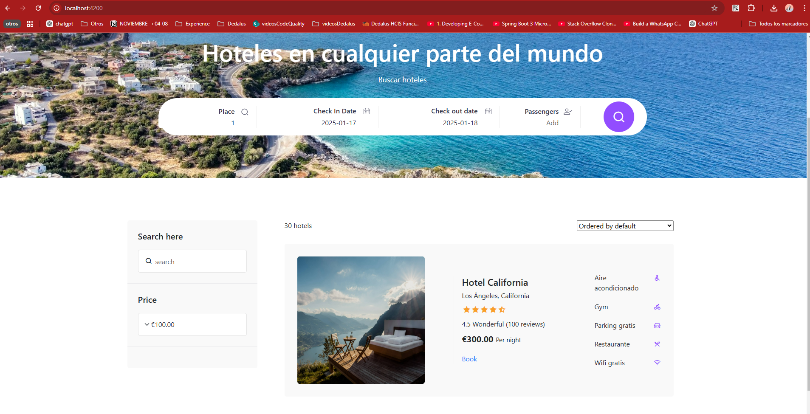

# Angular and Java Spring Boot Hotels Book App

This is a web application built with **Spring Boot 3.4.1** for the backend and **Angular 17** for the frontend. It manages and displays information about hotels, services, and reviews. The application is composed of **three microservices**:

---

## Frontend Repository

The frontend of the application is built with Angular and can be found in the following repository:

[Frontend Repository - Angular](https://github.com/PagarciaSima/HotelBooks_Angular)

---

## Features

- **Reviews Service**: Manages user reviews for hotels and services.
- **Services Service**: Handles the various services offered by hotels.
- **Hotels Service**: Manages hotel data, including room information, availability, and pricing.

---

## Technologies

- **Backend**: Spring Boot 3.4.1
- **Frontend**: Angular 17 (with standalone components)
- **CSS**: SCSS for styling
- **Libraries**:
  - **Bootstrap**: ^5.3.3 for responsive design and UI components
  - **ng2-date-picker**: ^17.0.0 for date selection functionality
  - **remixicon**: ^4.2.0 for vector icon usage
- **Database**: MySQL for data storage
- **Microservices Architecture**: Each core feature (reviews, services, hotels) is handled by an independent microservice.
- **OpenAPI Documentation**: The API is documented using **OpenAPI** in **YAML format** for **Swagger**, providing a clear interface for interaction with the backend.
- **Containerization**: Docker is used to containerize the application, ensuring easy and consistent deployment across different environments.

---

## Application Interface

### Hotels search


---

## Database and Postman Collection

- The **database** and the **Postman collection** are located in the `Extras` folder of the project.
  - The database can be imported into your local database system for testing.
  - The Postman collection can be used to test the endpoints of the API.
- The **OpenAPI documentation** YAML files are also included in the project, providing the API interface for integration and testing.

---

## Setup and Installation

### Backend (Spring Boot with Docker)

1. Clone the repository.
2. Navigate to the root folder where the `docker-compose.yml` file is located.
3. Run Docker Compose to bring up the microservices:
   ```bash
   docker-compose up